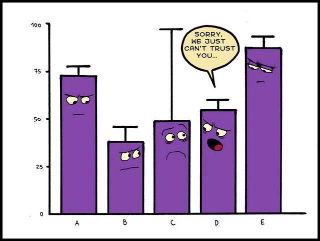

```{r setup, include = FALSE}
knitr::opts_chunk$set(echo = TRUE)
```

```{r load packages, include = FALSE, echo = FALSE}
# need to use install.packages("packagename") first where packagename is 
# the name of a general package (like nlme, for example)
library(knitr)
library(tidyverse)
library(nlme)
library(emmeans)

# options for text size: Huge > huge > LARGE > Large > large > normalsize > small > footnotesize > scriptsize > tiny
```

# Introduction 

## Background

* Slides available on my GitHub [here](https://github.com/michaeldumelle/OSUHort_11302020)

* PhD in Statistics from Oregon State University (2020)

* Research statistician at the Environmental Protection Agency

## Background

* OSU Statistics Consulting Practicum

    * Encourage you to sign up!
    
    * Long format vs drop-in
    
    * Faculty are encouraged too - separate process

* Worked on several turfgrass projects with Alec Kowalewski and Clint Mattox

* Use Analysis of Variance (ANOVA) to study designed experiments

    * Are there *statistically significant differences* among treatment effects?

* One common problem: unequal variance / standard deviation within treatment groups

    * How can we use ANOVA to best understand our data when there is unequal variance?
    
## Experiment Roadmap 

1. Formulate a hypothesis

2. Choose an experimental design

3. Choose an analysis method

4. **Randomize** treatments

5. Collect data
    
6. Analyze data using ANOVA

    * $Y_i = \mu + \alpha_i + \epsilon_i$ (focus on one-way ANOVA)

    * Estimate treatment effects from the data

    * Do these estimates ($\hat{\alpha}$) suggest *statistically significant differences* among the true treatment effects ($\alpha$)?
    
7. Report results

# Why ANOVA?

## Properties

ANOVA has several attractive propeties:

1. Estimates of treatment effects equal the true treatment effects *on average*

    * But we only get to run the experiment once!

2. $\color{red}{\text{Treatment effect confidence intervals are as small as possible}}$

3. $\color{red}{\text{Hypothesis tests have well known forms}}$

But 2 and 3 rely on specific $\color{red}{\text{assumptions}}$ on the errors, $\epsilon$

## Assumptions on $\epsilon$

1. Independence

    * Unit A does not depend on unit B
    
    * Dice roll, coin flip

2. Normality 

3. $\color{red}{\text{Constant Variance}}$

    * Variance homogeneity
    
* This presentation focuses on 3.
    
## Assumptions on $\epsilon$

When the constant variance assumption is violated, the ANOVA

* Estimates of treatment effects still equal the true treatment effects *on average*
    
    * Great!

* $\color{red}{\text{Treatment effect confidence intervals are too lage}}$
    
    * Inefficient use of resources
    
* $\color{red}{\text{Hypothesis tests don't have well known forms}}$
    
    * Incorrect p-values $\rightarrow$ misleading conclusions, poor policy decisions

## Assumptions

```{r boxplot image, echo = FALSE, fig.align = "center", out.width = "75%", out.height = "75%"}

```

## How Do I Know?

* Graphics! If it looks off, it probably is

* Ratio of largest and smallest variances

    * Suggestions of cutoff range from 1.5 to 9

* Statistical tests for constant variance

    * Levene's, Brown-Forsythe, several others
    
    * Come with their own assumptions
    
## What Now?

So I know my data does not have constant variance, what now?

* Could transform the response, $Y$, so that the transformed $Y$ satisfy standard assumptions

    * Can be very useful

    * Generally require a specific mean / variance relationship, $log_e(Y)$ often used
    
Poses pratical considerations:

* Challenging to find an appropriate transformation
    
* Difficult to interpret on original scale (usually of interest)
    
    * Significant difference between treatments on transformed scale $\color{red}{\text{DOES NOT}}$ imply the same on the original scale

* What else?

# GV-ANOVA

## What is GV-ANOVA?

* Can use Generalized Variance ANOVA (GV-ANOVA) to directly model variances within groups

    * Separate variance for each treatment level
    
    * Does not require a mean / variance relationship
    
    * No transformation requirement
    
    * Requires the estimation of more variance parameters than when using a transformation
    
* Goal of this talk is to expose you to another possible way to handle the non constant variance problem 

* Important to be aware of both approaches


# Application

## Example

\tiny

```{r, include = FALSE, echo = FALSE}
data <- read_csv("C:/Users/mdumelle/Documents/presentations/OSUHort_11302020/GitHub/OSUHort_11302020/data.csv")
```

```{r}
anova_mod <- gls(response ~ trt, data = data)
anova(anova_mod)
emmeans(anova_mod, list(pairwise ~ trt), adjust = "bonferroni")
```

## Example

\tiny 

```{r}
gvanova_mod <- gls(response ~ trt, weights = varIdent(form = ~ 1|trt), data = data)
anova(gvanova_mod)
emmeans(gvanova_mod, list(pairwise ~ trt), adjust = "bonferroni")
```

\normalsize

# Conclusions