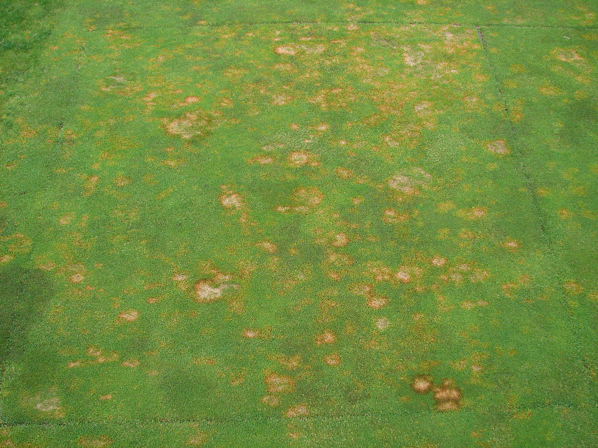

```{r setup, include = FALSE}
knitr::opts_chunk$set(
  collapse = TRUE,
  comment = "#>", 
  warning = FALSE, 
  message = FALSE,
  include = TRUE, 
  echo = FALSE
)
```

```{r load packages}
# need to use install.packages("packagename") first where packagename is 
# the name of a general package (like nlme, for example)
library(knitr)
library(tidyverse)
library(nlme)
library(emmeans)
library(kableExtra)
library(car)

# options for text size: Huge > huge > LARGE > Large > large > normalsize > small > footnotesize > scriptsize > tiny
```

# Introduction 

## Background

* Slides available on my GitHub [here](https://github.com/michaeldumelle/OSUHort_11302020)

* PhD in Statistics from Oregon State University (2020)

* Research statistician at the Environmental Protection Agency

* I will interweave R code to illustrate ideas

```{r}
this_is_a_function <- function(argument) {
  return(argument)
}
this_is_an_argument <- "this is output"
```

\scriptsize

```{r, echo = TRUE}

# this is a comment
this_is_some_code <- this_is_a_function(this_is_an_argument)
print(this_is_some_code)
```

## Background

* OSU Statistics Consulting Practicum

    * Encourage you to sign up!
    
    * Long format vs drop-in
    
    * Faculty are encouraged too - separate process

* Worked on several turfgrass projects with Alec Kowalewski and Clint Mattox

* Use Analysis of Variance (ANOVA) to study designed experiments

    * Are there *statistically significant differences* among treatment effects?

* One common problem: unequal variance / standard deviation within treatment groups

    * How can we use ANOVA to best understand our data when there is unequal variance?
    
## Experiment Roadmap 

1. Formulate a hypothesis

2. Choose an experimental design

3. Choose an analysis method

4. **Randomize** treatments

5. Collect data
    
6. Analyze data using ANOVA

    * $Y_i = \mu + \alpha_i + \epsilon_i$ (focus on one-way ANOVA)

    * Estimate treatment effects from the data

    * Do these estimates ($\hat{\alpha}$) suggest *statistically significant differences* among the true treatment effects ($\alpha$)?
    
7. Report results

# Why ANOVA?

## Properties

ANOVA has several attractive propeties:

1. Estimates of treatment effects equal the true treatment effects *on average*

    * But we only get to run the experiment once!

2. $\color{red}{\text{Treatment effect confidence intervals are as small as possible}}$

3. $\color{red}{\text{Hypothesis tests have well known forms}}$

But 2 and 3 rely on specific $\color{red}{\text{assumptions}}$ on the errors, $\epsilon$

## Assumptions on $\epsilon$

1. Independence

    * Unit A does not depend on unit B
    
    * Dice roll, coin flip

2. Normality 

3. $\color{red}{\text{Constant Variance}}$

    * Variance homogeneity
    
* This presentation focuses on 3.
    
## Assumptions on $\epsilon$

When the constant variance assumption is violated, the ANOVA

* Estimates of treatment effects still equal the true treatment effects *on average*
    
    * Great!

* $\color{red}{\text{Treatment effect confidence intervals are too lage}}$
    
    * Inefficient use of resources
    
* $\color{red}{\text{Hypothesis tests don't have well known forms}}$
    
    * Incorrect p-values $\rightarrow$ misleading conclusions, poor policy decisions

## Assumptions

```{r boxplot image, echo = FALSE, fig.align = "center", out.width = "75%", out.height = "75%"}
include_graphics("trust_boxplot.png")
```

## How Do I Know?

* Graphics! If it looks off, it probably is

* Ratio of largest and smallest variances

    * Suggestions of cutoff range from 1.5 to 9

* Statistical tests for constant variance

    * Levene's, Brown-Forsythe, several others
    
    * Come with their own assumptions
    
## What Now?

So I know my data does not have constant variance, what now?

* Could transform the response, $Y$, so that the transformed $Y$ satisfy standard assumptions

    * Can be very useful

    * Generally require a specific mean / variance relationship, $log_e(Y)$ often used
    
Poses pratical considerations:

* Challenging to find an appropriate transformation
    
* Difficult to interpret on original scale (usually of interest)
    
    * Significant difference between treatments on transformed scale $\color{red}{\text{DOES NOT}}$ imply the same on the original scale

* What else?

# GV-ANOVA

## What is GV-ANOVA?

* Can use Generalized Variance ANOVA (GV-ANOVA) to directly model variances within groups

    * Separate variance for each treatment level
    
    * Does not require a mean / variance relationship
    
    * No transformation requirement
    
    * Requires the estimation of more variance parameters than when using a transformation
    
* Goal of this talk is to expose you to another possible way to handle the non constant variance problem 

* Important to be aware of both approaches


# Application

## Percent Green Cover

```{r turfgrass image, echo = FALSE, fig.align = "center", out.width = "75%", out.height = "75%"}

```

## Create Data

- Use a simulation to compare ANOVA and GVANOVA

    - So helpful because we know the truth!
    
    - Study several scenarios without having to design an experiment, collect data, etc.
    
```{r}
sim_df <- data.frame(Treatment = c("A", "B", "C", "D"),
                     Mean = c(50, 50, 58, 60),
                     StDev = c(5, 2, 1, 0.5),
                     Replicates = c(8, 8, 8, 8))
kableExtra::kbl(sim_df, booktabs = T, caption = "Treatment Means, Standard Deviations (StDev), and Replicates") %>%
  kable_styling(latex_options = "striped")
```

## Create Data
    

- Study pairwise differences between treatments at $\alpha = 0.05$

    - For each comparison, compute a test statistic and a p-value
    
    - Reject a true null hypothesis (Type I error, false positive)
    
    - Do not reject a true alternative hypothesis (Type II error, false negative)

    - Family-wise error rate is $\alpha \rightarrow$ multiple comparison adjustment (Bonferroni)
    
    - Degree of freedom adjustments (Sattherwaite)

## Create Data

\small

```{r}
create_data <- function(treatments, means, stdevs, replicates) {
  n <- sum(replicates)
  treatments <- factor(rep(treatments, times = replicates))
  means <- rep(means, times = replicates)
  stdevs <- rep(stdevs, times = replicates)
  sigma <- diag(stdevs^2)
  response <- as.vector(means + t(chol(sigma)) %*% rnorm(n))
  data <- data.frame(treatments, response)
}
```

```{r, echo = TRUE}
set.seed(1130)
data <- create_data(treatments = c("A", "B", "C", "D"), 
                    means = c(50, 50, 58, 60),
                    stdevs = c(5, 2, 1, 0.5),
                    replicates = c(8, 8, 8, 8))
head(data, n = 9)
```


## Create Data

```{r, fig.cap = "Caption"}
ggplot(data, aes(x = treatments, y = response)) +
  geom_point(size = 0.8)  +
  labs(x = "Treatment Group",
       y = "Percent Green Cover") +
  theme(title = element_text(size = 9))
```

## Create Data

```{r}
ggplot(data, aes(x = treatments, y = log(response))) +
  geom_point(size = 0.8)  +
  labs(x = "Treatment Group",
       y = "Percent Green Cover") +
  theme(title = element_text(size = 9))
```


## Data Summaries

\small

```{r, echo = TRUE}
group_summaries <- data %>% 
  group_by(treatments) %>%
  summarize(grp_mean = mean(response),
            grp_stdev = sd(response))
```

```{r}
kableExtra::kbl(group_summaries, 
                booktabs = T,
                caption = "Treatment Group Summaries",
                col.names = c("Treatments", "Group Mean", "Group StDev"),
                digits = 3) %>%
  kable_styling(latex_options = "striped")
```


## Are the Unequal Variances a Problem?

\footnotesize

```{r, echo = TRUE}
# ratio of largest and smallest stdev
max_stdev <- max(group_summaries$grp_stdev)
min_stdev <-  min(group_summaries$grp_stdev)
stdev_ratio <- max_stdev / min_stdev
stdev_ratio
stdev_ratio > 3

# levene's test
leveneTest(response ~ treatments, data = data)
```


## Fit Models

\tiny

```{r, echo = TRUE}
anova_mod <- gls(response ~ treatments, data = data)
anova_trtmeans <- emmeans(anova_mod, "treatments")
pairs(anova_trtmeans, adjust = "bonferroni")
```

```{r, eval = FALSE, echo = TRUE}
# SAS Code
proc mixed data=data;
  class treatments;
  model response = treatments;
  lsmeans treatments / diff adjust=BON;
run;
```


## Example

\tiny 

```{r, echo = TRUE}
gvanova_mod <- gls(response ~ treatments, weights = varIdent(form = ~ 1|treatments), data = data)
gvanova_trtmeans <- emmeans(gvanova_mod, "treatments")
pairs(gvanova_trtmeans, adjust = "bonferroni")
```

```{r, eval = FALSE, echo = TRUE}
# SAS Code
proc mixed data=data;
  class treatments;
  model response = treatments / ddfm=SAT; # this is different
  repeated / group = treatments; # this is different
  lsmeans treatments / diff adjust=BON;
run;
```

\normalsize

# Conclusions